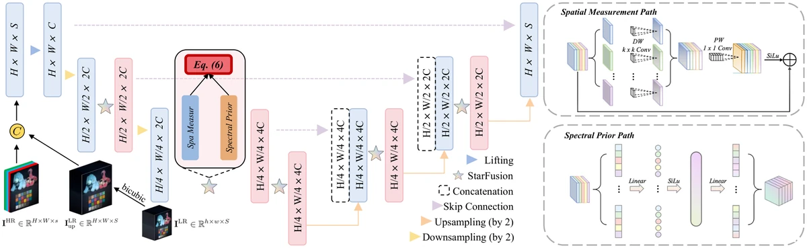

<div align="center">

# Asymmetric StarFus

### Learning Incoherent Measurements for Semantics-Aware Spatial–Spectral Fusion

[](https://doi.org/10.1109/ICASSP55912.2026.11461717)
[](https://doi.org/10.1109/ICASSP55912.2026.11461717)
[](https://pytorch.org/)
[](LICENSE)

**Jieyuan Pei**¹, Wei Li¹, Zhuoxuan Li², Junwei Zhu¹, Chuangjie Fang¹, Jianwei Zheng¹†

¹ Zhejiang University of Technology &nbsp;·&nbsp; ² Tongji University &nbsp;·&nbsp; † Corresponding author

</div>

<p align="center">
  
</p>

**StarFus-Net** fuses a low-resolution hyperspectral image (LR-HSI) with a high-resolution RGB /
multispectral image into a high-resolution hyperspectral image. It is designed from generative
compressed-sensing theory: the signal is assumed to lie on a low-dimensional manifold that can be
sparsely represented, so the network lifts features into a wider space and learns decorrelated,
*incoherent* measurements of them.

## Highlights

- **Asymmetric StarFusion block.** A spatial *measurement* path (two depthwise 5×5 residual blocks
  and a 1×1 projection) and a spectral *prior* path (a per-pixel MLP that lifts every pixel to a
  wider hidden width and back) are combined as
  `α · (F_spatial ⊙ RMSNorm(F_spectral)) + β · (F_spatial + F_spectral)`
  and added back through a learnable residual scale.
- **Small U-Net.** Two downsampling stages, StarFusion blocks at every scale, and a
  zero-initialised head that predicts a residual on top of the upsampled LR-HSI.
- **Efficient.** Best PSNR on CAVE and Harvard at ×4 and ×8 with 39.76 GFLOPs on CAVE, against
  67–3469 GFLOPs for the compared methods (Table 1 of the paper, below).

## Results

PSNR (dB) from Table 1 of the paper, higher is better. Parameters and FLOPs are the values reported
for CAVE; SAM, ERGAS and SSIM are in the paper.

| Method | Params (M) | FLOPs (G) | CAVE ×4 | CAVE ×8 | Harvard ×4 | Harvard ×8 |
|:--|--:|--:|--:|--:|--:|--:|
| DHIF (2022) | 22.39 | 3468.93 | 52.01 | 50.18 | 48.26 | 47.97 |
| PSRT (2023) | 0.26 | 67.23 | 51.43 | 49.23 | 48.21 | 47.17 |
| DSPNet (2023) | 6.06 | 422.19 | 52.08 | 50.23 | 48.84 | 48.00 |
| MIMO (2024) | 4.98 | 98.08 | 51.60 | 49.30 | 48.91 | 48.11 |
| KNLConv (2024) | 1.32 | 170.90 | 51.92 | 48.66 | 48.73 | 47.89 |
| **StarFus-Net** | 1.32 | **39.76** | **52.58** | **50.30** | **49.25** | **48.52** |

## Usage

The repository contains the model definition, [`starfus.py`](starfus.py) (PyTorch only).

```python
import torch
from starfus import StarFusionUNet

net = StarFusionUNet(out_dim=31, m=1024)   # 1.32 M parameters, the size reported in the paper
lr_up = torch.randn(1, 31, 256, 256)        # LR-HSI, upsampled to the size of the guide image
rgb = torch.randn(1, 3, 256, 256)           # HR-RGB / MSI guide
hr = net(lr_up, rgb)                        # (1, 31, 256, 256) HR-HSI
```

- `m` is the hidden width of the spectral path. The default `m=256` gives a lighter
  0.53 M-parameter variant.
- Height and width must be divisible by 4 (two stride-2 stages).
- The head is zero-initialised, so an untrained network returns `lr_up` unchanged.
- `ModelStarFusionCave` / `ModelStarFusionHarvard` wrap the same U-Net behind a
  `forward(x, up_LR, RGB)` interface; the first argument is unused.

Training and evaluation scripts are not included in this repository yet.

## Citation

```bibtex
@inproceedings{pei2026starfus,
  title     = {Asymmetric {StarFus}: Learning Incoherent Measurements for Semantics-Aware Spatial-Spectral Fusion},
  author    = {Pei, Jieyuan and Li, Wei and Li, Zhuoxuan and Zhu, Junwei and Fang, Chuangjie and Zheng, Jianwei},
  booktitle = {IEEE International Conference on Acoustics, Speech and Signal Processing (ICASSP)},
  year      = {2026},
  doi       = {10.1109/ICASSP55912.2026.11461717}
}
```

## Related

From the same group: [S³O](https://github.com/GuobaPei/Selective-Spatial-Spectral-Operator)
(Findings of CVPR 2026) for cross-scale spatial–spectral fusion, and
[Hyperbolic Neural Operator](https://github.com/GuobaPei/Hyperbolic-Neural-Operator) (ICML 2026).

## Contact

Open a GitHub issue, or contact the corresponding author Jianwei Zheng (`zjw@zjut.edu.cn`).

## License

MIT License. See [LICENSE](LICENSE).
